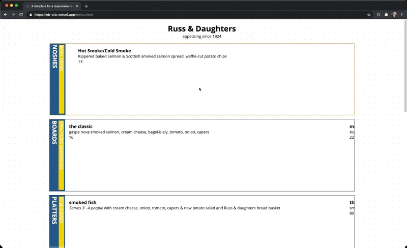
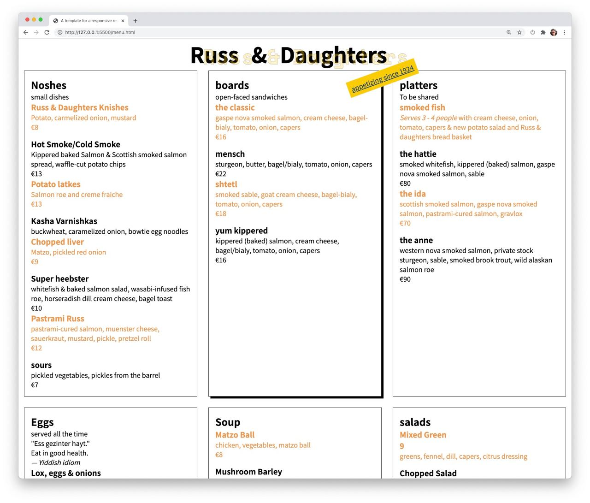
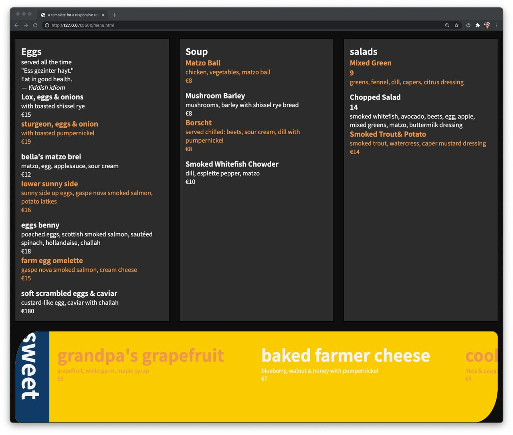
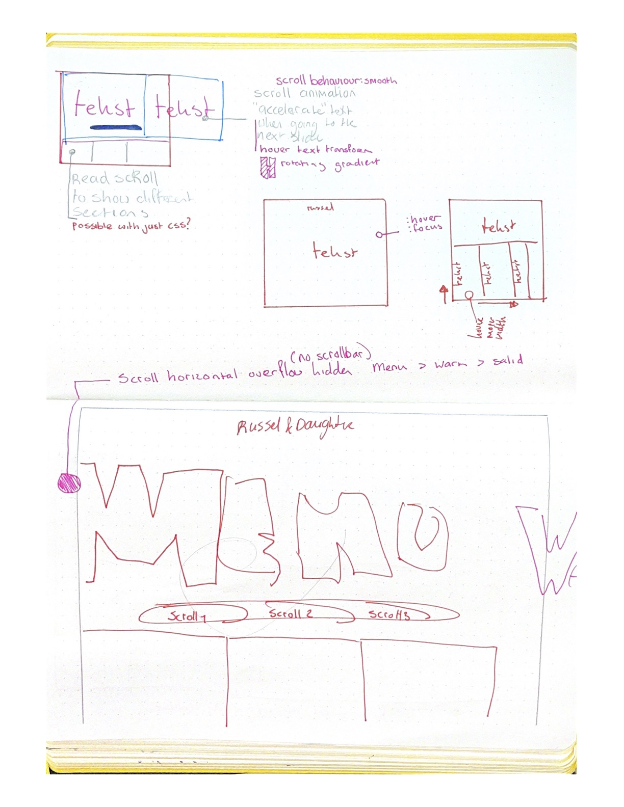

**Table of Content**

- [Information](#info)
- [Plan](#week-1)
- [Progression](#week-2)
- [Progression part II](#week-3)
- [Finish](#week-4)

# Info

The core of this subject is to stress on CSS. We aren't allowed to use any JavaScript for interaction and have to find alternatives for those interactions.

The goals for this subject is as following:

- Experiment with CSS-techniques that are new for you.
- Know the full extent of CSS, that CSS is not just for styling.
- Understanding of the interaction techniques from CSS (and HTML). UX is humane within the chosen context(s).
- Progressive enhancement is elegantly applied. You can show how cascase, inheritance and specificity works.

There are two restrictions in this course:

1. Don't use `id="id"` or `class="class"`. The reason for this restriction is so we practice with the CSS selectors.
   - The caveat for this restriction is the `:target` selector which requires an ID.
   - If you don't see a way out without ID's or classes, follow the following steps:
     - Google it
     - Ask students
     - Ask teachers
     - Use class or ID.
1. Don't use JavaScript. If you plan to use interaction which isn't achievable by using CSS, scrap that interaction.

---

# Resit

## Result

## Tip Top Improve

## Insight

## Misc

# Week 4

## Result

## Tip Top Improve

**TIP:**

- Experiment more with foreign CSS techniques

**TOP:**

- GRID / FLEX
- Keyboard accessibility

**IMPROVE:**

- Use new techniques, shapes, animation

### Went Well

Creating a responsive website that works on all kinds of displays.

### Went Bad

Experimenting to a sufficient level with many css tricks.

### Proud

Keeping the CSS concise and using variable css calculation tricks such as `clamp`, `calc` or `minmax`

## Insight

What have I learned is that flex can do a whole lot more than just aligning content on a horizontal axis. The scrolling part blew my mind. Also I have learned that everything is possible with CSS if you experiment, it is a matter of attempting and recreating. Clamp really gave me an insight to write less CSS for more. I can condense `min-width`, `width` and `max-width` in one line with `width: clamp()`.

## Misc

What do I want to improve further? Which CSS skills will I improve upon?

I would like to experiment with CSS shapes and animations to create a visual cohesive design that can strengthen the content. I feel like I should have experimented more and disregard the original shape of the HTML and edit it more. throw away the skeletal structure thought and grow some bones with CSS.

# Week 3

## Progression week 3

Created a grid in a grid with flex items and learned about snapping elements within

### Went Well

Learning about the flex and how to apply it to create scrolling components.

refactoring the code to be concise without extra.

### Went Bad

Working with animations and transistions as that was my plan for this week.

### Insights CSS-POWER

CSS has alot of hidden properties that change the whole dynamic of what CSS is in my opinion.

### Change of Plans

Changing the concept to allow for CSS experimentations.
Don't be bland, be extravagant.

### New Challenges

Making it pretty with animations and transitions. Possibly go wild and do something special per section.

I would like to animate either the background or sections to a visually pleasing component, with CSS shapes or with animations to show or hide the dishes. just like the following example:

# Week 2

## Progression week 2

### Went Well

- Creating a grid for every section.
- Using CSS selectors.

### Went Bad

- Organizing my thoughts.
- Keeping the CSS structured.
- Animations
  - Not sure how to add animations to my idea. Might solely focus on transitions.
- Adhering to one idea. Currently my project isn't made based on the restriction or contexts.

### Insights CSS-POWER

There are many different keywords to do something in CSS.
For example, selectors, There are similar things that just work differently but can easily achieve the same. For example a responsive design can be easily made with 6 lines of CSS with grid.

### Change of Plans

Move towards a style and enhance that style.

### New Challenges

1. Write clean CSS.
1. Implement interaction with animation and transition.
1. Create a mouse-free website?

# Week 1

### Which Assignment

I would like to visualize the menu with animations and a sleek design.

### Which Context and Restrictions

#### Contexts

The contexts I would like to apply to the menu:

- print-stylesheet
  - To have a visually appealing menu on paper..
- prefers-color-scheme
  - Menu follows the system's appearance, be it light or dark mode.
    - To go an extra step the menu would also be available in a high contrast mode by using `@media (prefers-constrast: no-preference || more || less )`.
      - Currently according to mozilla it is only available in [firefox version 80 and beyond.](https://developer.mozilla.org/en-US/docs/Web/CSS/@media/prefers-contrast) but according to [caniuse.com](https://caniuse.com/?search=prefers-contrast) in no browsers. 🧪**requires testing**.🧪

#### Restrictions

To challenge myself, I have picked the following restrictions:

- Two colours
  - With this restriction I would like to enhance the visibility of the website but also experiment with filters and such. Ofcourse I still will use black and white as those are [tints and shades, not colours](https://www.adobe.com/creativecloud/design/discover/is-black-a-color.html#:~:text=Black%20is%20the%20absence%20of,on%20the%20visible%20light%20spectrum.&text=But%20in%20a%20technical%20sense,colors%2C%20they're%20shades.).
- Responsive design without media queries
  - Creating a responsive menu for small screen users without `@media only screen and (min-width: 600px)`  
    This will be done with techniques like `grid` and `flex`.

#### CSS Techniques

CSS techniques that I would like to use and become proficient in are `animating`, `interaction`, and `grid`.  
The mentioned techniques are also techniques I am going to implement.

#### Biggest Challenge

In my opinion the biggest challenge would be the animating and interaction part because I haven't done much or anything with it so far. I have done some work with grid, but wouldn't say I am procifient with it.

#### Sketches

| First concept                                                      | Second concept                                                |
| ------------------------------------------------------------------ | ------------------------------------------------------------- |
|    |  |
| My first idea was a typical menu, divided in blocks per categorie. | After browsing and thinking I decided to take another step.   |

[Dribbble inspiration](https://dribbble.com/Dewarian/collections/4446378-Menu-Inspo)
**Things to be cautious about**

- Colours that work and are clearly visible on either black or white.
  [Similar Behance inspiration](https://www.behance.net/search/images?similarStyleImagesId=546989879)
  [Behance inspiration](https://www.behance.net/collection/182174061/Menu-Inspo)

#### Feedback

The feedback that I have received Friday was that it is a cool idea, and it is possible with CSS. Besides that I also need to do a first sketch, breakdown sketch, how I want to animate it and what my CSS challenges will be.

# Sources

[Codepen sessie met Sanne 't Hooft over Animeren](https://codepen.io/dewarian/pen/WNoGXLe?editors=0100)
[Notities over de colleges 10-02-2021](https://www.notion.so/CTTTR-L3-10f9c27cdfcf43aea92c57600120f07c)

---

Notes | links

<a href="https://codepen.io/cferdinandi/pen/LqGZrb">https://codepen.io/cferdinandi/pen/LqGZrb</a>

<a href="https://css-tricks.com/can-get-pretty-far-making-slider-just-html-css/">https://css-tricks.com/can-get-pretty-far-making-slider-just-html-css/</a>

  
Original Repo Content

  # CSS to the Rescue @cmda-minor-web 2020 - 2021

Wij vinden het web fascinerend. De laatste jaren is CSS een volwassen en zeer krachtige taal geworden (niet langer een bottleneck - integendeel). Veel van de (nieuwe) **CSS-lekkernijen** worden echter nog niet ten volle benut. Sommige delen van de spec worden onterecht (nog) niet bemind, andere delen zijn zo groot en complex dat we mogelijkheden nog niet hebben doorgrond. Aan jou de mooie opdracht om de onontgonnen delen van de CSS-wereld in kaart te brengen.

**In dit vierweekse vak ga je experimenteren met (voor jou) nieuwe CSS technieken - om daarna/mee een innovatieve, experimentele én aangename ervaring te creëren - met vanilla CSS en HTML dus (frameworks, preprocessors, libraries en JS zijn niet toegestaan).**

Nb. Het experiment wordt gewaardeerd - zelfs/zeker als het niet (helemaal) lukt. Voel je vrij om verder te gaan dan de CSS-technieken die je al beheerst.

## Dingen om vooraf te doen

- 🔱 **Fork** deze repository
- ✅ [**Enroll** je voor de minor via de courselector](https://icthva.sharepoint.com/sites/courseselector#/CourseSelector/web-design-and-development/2020-2021) (dan kun je je werk straks ook op [DLO](https://dlo.mijnhva.nl/d2l/home/275640) opleveren)
- 🎥 **Camera's aan** tijdens lessen en co (zorg dat je webcam werkt)
- 📒 **Bekijk** het programma en de kennismakingsoefening alvast even

## Opdrachten

Het vak bestaat uit:

- [Een kennismakingsoefening](https://cmda-minor-web.github.io/css-to-the-rescue-2021/oefening.html)
- [De eindopdracht](https://cmda-minor-web.github.io/css-to-the-rescue-2021/index.html)

De [beoordelingscriteria voor de eindopdracht](https://cmda-minor-web.github.io/css-to-the-rescue-2021/beoordelingsformulier.html) op een rijte.

## Programma

Het vak beslaat 4 weken. Bekijk de presentatie met alle details [soon].

In Teams vind je de [Excel met de indeling en planning](https://teams.microsoft.com/l/file/6E37FED4-91C7-4293-A7C4-C0309D24634D?tenantId=0907bb1e-21fc-476f-8843-02d09ceb59a7&fileType=xlsx&objectUrl=https%3A%2F%2Ficthva.sharepoint.com%2Fsites%2FFDMCI_EDU__CMD20_21_Minor_Web_5i7j73jt%2FShared%20Documents%2F03%20-%20CSS%20to%20the%20Rescue%2FCSS%20to%20the%20rescue%20-%20Indeling%20%26%20Planning.xlsx&baseUrl=https%3A%2F%2Ficthva.sharepoint.com%2Fsites%2FFDMCI_EDU__CMD20_21_Minor_Web_5i7j73jt&serviceName=teams&threadId=19:84bbb4a3b90d40a6b434649359689744@thread.tacv2&groupId=5d001f9a-0a4b-4768-92b1-0f1768328ba3).
Daar schrijf je je ook in voor themasessies en het eindgesprek.

Colleges, lessen en gesprekken vinden plaats [in Teams](https://teams.microsoft.com/l/channel/19%3a84bbb4a3b90d40a6b434649359689744%40thread.tacv2/03%2520-%2520CSS%2520to%2520the%2520Rescue?groupId=5d001f9a-0a4b-4768-92b1-0f1768328ba3&tenantId=0907bb1e-21fc-476f-8843-02d09ceb59a7).

## Docenten

- Vasilis van Gemert
- Thijs Spijker
- Sanne 't Hooft
- Leonie Smits

## Learning goals

- _You understand the broader scope of CSS: You can show that CSS can be used for more than just styling web pages._
- ~~_You understand the progressive enhancement parts of CSS: You can show that you can use the cascade, inheritance and specificity in your project_~~
- _You understand the interactive parts of CSS: Is the UX fully enhanced within in given CSS scope?_
- _You have been experimenting: Have the learning goals been stretched?_

## De Selector First CSS & No JS aanpak

Het **eerste uitgangspunt** is dat je _geen_ ID's en classes gebruikt. Niet omdat ze niet nuttig zijn, maar om te oefenen met de [vele CSS selectoren](https://css-tricks.com/almanac/) die je tot je beschikking hebt. ID's mag je alleen gebruiken om de :target selector te triggeren. En als het echt echt echt niet anders kan, heb je permissie om een paar classes toe te voegen.

Een **tweede uitgangspunt** is dat je _geen_ JS gebruikt (i.i.g. zo min mogelijk - het vak heet niet voor niets CSS to the Rescue). Wat met CSS en/of HTML kan mag je _niet_ met JS realiseren en het is _niet_ toegestaan om CSS properties met JS aan te passen. We vinden het daarentegen wel interessant dat je verkent waar JS en CSS elkaar raken/versterken, bijv. het [uitlezen en aanpassen van CSS custom properties](https://developer.mozilla.org/en-US/docs/Web/CSS/Using_CSS_custom_properties), of bijv. de [animationstart](https://developer.mozilla.org/en-US/docs/Web/API/HTMLElement/animationstart_event), [animationcancel](https://developer.mozilla.org/en-US/docs/Web/API/HTMLElement/animationcancel_event), [animationiteration](https://developer.mozilla.org/en-US/docs/Web/API/HTMLElement/animationiteration_event) en [animationend](https://developer.mozilla.org/en-US/docs/Web/API/HTMLElement/animationend_event) events gebruiken.

